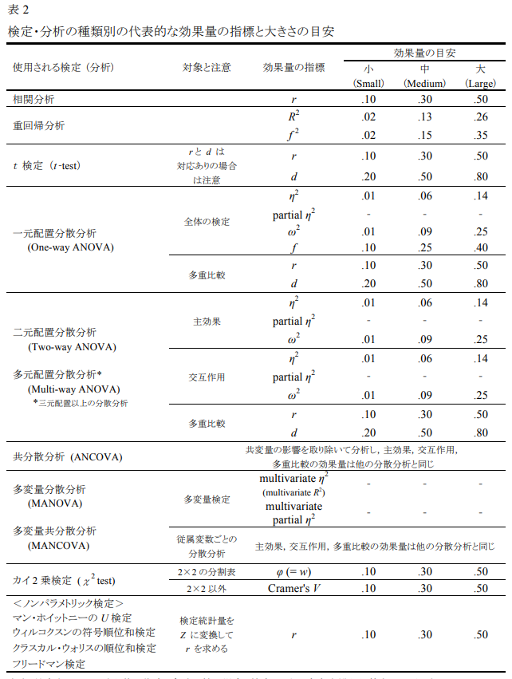

# Week 13: 効果量と検定力分析

```{r, include=FALSE}
library(tidyverse)
```

## 事前の確認

- この講義のRプロジェクトを開いていますか？
- 英数字で名前を付けた本日の講義のファイルを作成しましたか？

  - .Rでも.Rmdでもどちらでも大丈夫です。

## 今日の目標

1. 効果量と検定力分析について理解できる
2. 検定力分析をRを用いて行うことができる

## 効果量

### 効果量の重要性
- 統計的検定の問題点：サンプルサイズが大きくなればなるほど、実質的に差がなくても統計的有意であるという結果になりやすい。

  - *p* 値のみに注目するのは危険
  
  - *p* 値は実質的な差の大小は教えてくれない
  
- *p* 値のみではなく、効果量も報告する

### 効果量とは

- 広義の効果量：統計的帰無仮説検定に依存していない

  - 「研究者が関心を持つ事柄の大きさ」

- 狭義の効果量：統計的帰無仮説検定に深く根差している（Cohenの定義）

  - 「現象が母集団に存在する程度、あるいは帰無仮説が偽である程度」
  
    - 標準化効果量が使用される。測定単位に依存しないため、様々な研究間で比較しやすい。

### 標準化効果量の概念的理解

- 標準化とは、単位に依存しない値にする

  - 例えば、 Cohenの *d* は以下のように、二群の平均値差を標準偏差（ *σ* ）で割ることで標準化している
  
$$
d = \frac{u_1 - u_2}{σ}
$$

### 様々な検定の標準化効果量

- 水本・竹内（2010）より引用

```{r, echo=FALSE, out.width='80%', fig.align='center'}

```

### 効果量の解釈
- （Week 5: 相関分析、相関係数の大きさより修正しつつ再掲）

- Cohenの効果量のベンチマークは広く使用されている指標である。しかし、これはもともとすべての分野に適応することを意図したものではなく、行動科学分野の研究に基づき作成されたものであった。

  - 小（small）： .10、中（Medium）：.30、大（Large）：.50

- 効果量の大きさは文脈（e.g., 研究分野や研究対象）において解釈する必要がある。

  - 例）リーディングのテスト得点とリスニングのテスト得点が *r* = .50の場合と、聞いた音を書きだすテストの得点と聴解のテスト得点が *r* = .50

- 第二言語習得研究における相関係数の目安として提示された例
  
>"For correlation coefficients, we suggest that rs close to .25 be considered small, .40 medium, and .60 large. These values correspond roughly to the 25th, 50th, and 75th percentiles in our primary and meta-analytic samples." (Plonsky & Oswald, 2014)

### 研究開始前における効果量の活用

- 統計的帰無仮説検定を行う場合、事前に必要なサンプルサイズを見積もる必要がある（次セクションの検定力）

  - 検定力分析には効果量が必要となり、その場合、最小関心効果量を決定する。最小である理由は、効果量を大きく設定するほど、必要サンプル数が減るため、謙虚な値で推定するため。
  
    - 先行研究などこれまでの知見などをもとに最小関心効果量を設定する必要がある

## 検定力分析
<div style="border: 2px solid skyblue; padding: 10px;">
手元のRでコードを動かしながらやってみましょう。データの読み込みなどはいりません。
</div>

- 統計的帰無仮説検定では、第一種の過誤、第二種の過誤、サンプルサイズ、そして効果量によってその結果が決まる。つまり、4つのうち3つが決まれば、残りの一つは自動的に決まる。この関係性を利用し、サンプルサイズを推定する。

- 検定力とは、1 - 第二種の過誤（ *β* ）で求められ、慣習的に0.8に設定されることが多い

### 独立した2群の *t* 検定の例

- 危険率（有意水準）： 0.05

- 検定力： 0.8

- 効果量: 0.4

```{r}
#install.packages("pwr")
res <- pwr::pwr.t.test(
  sig.level = 0.05,         #危険率
  power = 1 - 0.2,　        #検定力
  d = 0.4,                  #効果量
  type = "two.sample",      #独立した2標本のt検定
  alternative = "two.sided" #両側検定
)
```

- 推定サンプルサイズは n = 99.08であるため、切り上げた値である200名（100名 × 2 ）が必要サンプルとなる
```{r}
res
```

```{r}
plot(res)
```

::: infobox
帰無仮説検定では事前のサンプルサイズ設計が必要と述べましたが、ベイズ統計でも事前のサンプルサイズの目安は必要です（事前登録などや研究費獲得など）。しかしベイズでは新たなデータを追加して分析することは可能ですが、帰無仮説検定ではできません（第一種の過誤の割合が増える）。従って、帰無仮説検定では検定力分析が必須となります。また、分析の前にはデータの削除などを行うことが多いため、ある程度余裕のあるサンプルサイズを確保する必要があります。
:::

### 対応のある2群の *t* 検定

```{r}
res.paired <- pwr::pwr.t.test(
  sig.level = 0.05,
  power = 1 - 0.2,
  d = 0.4,
  type = "paired",
  alternative = "two.sided"
)

res.paired
```

```{r}
plot(res.paired)
```


### 相関係数

```{r}
res.cor <- pwr::pwr.r.test(
  sig.level = 0.05,
  power = 1 - 0.2,
  r = 0.2
)

res.cor
```

```{r}
plot(res.cor)
```


### 一般線形モデル

- *F* 検定の検出力を推定するための関数（帰無仮説 = どの独立変数も従属変数の分散を説明していない）

```{r}
res_g <- pwr::pwr.f2.test(
  sig.level = 0.05, 
  power = 0.8,
  u = 2,                     #独立変数の数（切片を除く）
  f2 = 0.3/(1 - 0.3)         #効果量。30%の分散を説明すると仮定した場合の対応するf2の値
  )
```

- この関数の出力では、サンプルサイズ n ではなく、残差の自由度 v が返される。

```{r}
res_g
```

- サンプルサイズ *n* は以下のように求める

$$
n = v + u + 1
$$

- よって、23（22.72） + 2 + 1で26名の参加者が最低でも必要である

- 上記の人数をもとに検定力を求めることができる

  - 26名だと検定力が80%を超えている

```{r}
pwr::pwr.f2.test(
  sig.level = 0.05, 
  power = NULL,              #検定力を推定
  u = 2,                     #独立変数の数（切片を除く）
  f2 = 0.3/(1 - 0.3),        #効果量。45%の分散を説明すると仮定する
  v = 26 - 2 - 1             #残差の自由度
  )
```

### 線形混合モデル（階層モデル）

- シミュレーションベースのものなど複数存在するが、比較的簡易にできるものを紹介する。

- 級内相関係数やクラスターの数などを指定する必要がある

  - 級内相関係数：同じクラスタ（集団、グループ、クラスなど）内の観測値がどの程度似ているかを示す指標。集団間の分散 ÷ （集団間の分散 + 集団内の分散）。

```{r, message=FALSE}
#install.packages("sjstats")
library(sjstats)
```


```{r}
nofitem <- 10         #項目数

power.sjstats <- samplesize_mixed(
  eff.size = 0.02,    #効果量 (f2)
  df.n = 2,           #独立変数の数（切片は除く）
  icc = 0.1,          #クラスタ内相関 (ICC)
  power = 0.8,        #検定力
  sig.level = 0.05,   #有意水準
  k = NULL,           #参加者の数を推定するためこちらは指定しない
  n = nofitem         #クラスターごとにいくつのデータがあるか（項目数など）
)

power.sjstats
```

- 総サンプルサイズが計算されるため、項目数で割る
```{r}
power.sjstats$`Total Sample Size` / nofitem
```

- 級内相関係数の値で推定されるサンプル数は変わる

```{r, include=FALSE}
eff_size_f2 <- c(0.02, 0.15)

iccs <- c(0.05, 0.275, 0.5)

results <- data.frame()

for (i in 1:length(eff_size_f2)) {
  for (f in 1:length(iccs)) {
    power.sjstats <- samplesize_mixed(
      eff.size = eff_size_f2[i], 
      df.n = 2,
      power = 0.8,  
      sig.level = 0.05,  
      k = NULL,  
      n = 10, 
      icc = iccs[f] 
    )
    
    power <- ceiling(power.sjstats$`Total Sample Size` / 10)
    
    results <- rbind(results, data.frame(eff_size = eff_size_f2[i], icc = iccs[f], Samplesize = power))
  }
}
```

- 一般的にICCの値が大きいほど、必要サンプル数は減るが、このパッケージでは逆になっている

  - 恐らくこのパッケージでは、ICCが低い＝クラスタ内のばらつきが大きい → クラスタ（例：参加者）間の差異が小さいため、効果を検出しづらいとされ、よりサンプルが必要であるように設計されているから？

- 従って、あまり高すぎるICCを指定しない方が良い

```{r, echo=FALSE}
results %>%
  dplyr::arrange(desc(Samplesize)) %>%
kableExtra::kbl(col.names = c("Effect Size", "ICC", "Required Sample Size"),
             booktabs = T,
             align = "c") %>%
  kableExtra::kable_styling(bootstrap_options = c("striped", "hover"),
                full_width = T)
```

```{r, echo=FALSE, warning=FALSE, message=FALSE}
results %>%
  ggplot(mapping = aes(x = eff_size, y = Samplesize, color = as.factor(icc))) +
  geom_point(size = 1.2) +
  geom_line(alpha = 0.4, size = 1) +
  geom_text(aes(label = Samplesize), nudge_y = 2, size = 3, vjust = -0.5) + # Add the text labels with sample size values
  theme_bw() +
  xlab("Target Effect Size in a Model") +
  ylab("Required Minimum Sample Size") +
  ggtitle("Target Power is 80 %")
```


## 検定力分析の報告の例

- 言語研究では、基本的に、本研究の参加者セクションに記載する


<div style="border: 2px solid skyblue; padding: 10px;">
**階層モデルの例**

- 参加者数は、*sjstats* パッケージ（バージョン 0.18.1）の *samplesize_mixed* 関数（Lüdecke, 2021）を用いた検定力分析に基づいて決定した。効果量（ *f²* ）は 0.2、有意水準は 0.05、級内相関係数は 0.1、検出力（power）は 80％に設定した。分子の自由度は 2 であった。推定の結果、921 サンプルが必要であり、1 参加者あたりの項目数が 10 のため、93 人以上の参加者が必要と推定された。
</div>


## 次週までの課題
### 課題内容

1. 小テストに向けて今回の内容を復習する。必ず手でコードを入力してRを実行する。

2. 以下の研究を行いたいと考えています。この研究の検定力分析を行い、必要サンプル数を算出してください。得られた結果をRのコードなど併記してHTMLファイルにまとめてください。

<div style="border: 2px solid skyblue; padding: 10px;">
100名の高校生から出生時の体重と現在の摂取カロリーのデータを集め、出生時の体重で18歳時点での摂取カロリーの量を推定できるのか検証したい。以下の効果量と検定力、そして危険率を満たすにはどれくらいの学校からデータを取ればいいのだろう。
  
  - 効果量: 0.03
  
  - 検定力：90%
  
  - 危険率：5%
  
</div>


### 提出方法

-   R Markdownファイルで作成し、HTMLファイルに変換しTACTへ提出
-   締め切りは今週の木曜日23:59まで

## 参考文献
- 📚清水（2014）『個人と集団のマルチレベル分析』株式会社ナカニシヤ出版

- 📚竹内・水本（編著）（2023）『外国語教育研究ハンドブック【増補版】―研究手法のより良い理解のために』松柏社

- 📚中村（2025）『心理学・教育学研究のための効果量入門―Rを用いた実践的理解』北大路書房

- 📚南風原（2002）『心理統計学の基礎―統合的理解のために』有斐閣アルマ

- 📄[水本・ 竹内 (2010). 「効果量と検定力分析入門―統計的検定を正しく使うために―」 『メソドロジー研究部会報告論集』 47-73.](https://www.mizumot.com/method/mizumoto-takeuchi.pdf)

- 📄[Plonsky, L., & Oswald, F. L. (2014). How big is “big”? Interpreting effect sizes in L2 research. *Language Learning, 64*(4), 878-912.](https://onlinelibrary.wiley.com/doi/abs/10.1111/lang.12079)

```{=html}
<style>
.infobox {
  padding: 1em 1em 1em 4em;
  margin-bottom: 10px;
  border: 2px solid orange;
  border-radius: 10px;
  background: #f5f5f5 5px center/3em no-repeat;
}

.beg {
  background-image: url("https://blogger.googleusercontent.com/img/b/R29vZ2xl/AVvXsEjHtu3kBX8P39WYBBAjar9c8c1ladK2SYL6_gEMXFweQfauWVhSvCQP5KELsPX5KNL1uOddLLQ-aeMxv904OW_NFFfANhBYObfBV09KO2EXehrb9kMdCLZY1afsChib-7zIkBJbG6OrbJpM/s400/aisatsu_kodomo_boy.png");}

.caution {
  background-image: url("https://blogger.googleusercontent.com/img/b/R29vZ2xl/AVvXsEhzMqkpQ7vLUKvumbm6AFwTLQiCe7tlDb2Q0MAiISLsesZHnhj0kbRjB4U3se3UrDIHfIy0hlahyphenhyphenQu-V2tOR2LcV_lX7U8P5a8jtqPYv3Ah4L-JoYi8PhoaoehumGIdp2vrsX0rRyhXqwA/s800/mark_chuui.png");}
  
</style>
```